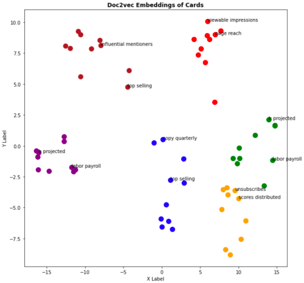

# Doc2vec-text-embedding

#### This notebook contains the code for the embedding of documents. The approach is to use the textual content for each data sample and learn a Doc2vec model to create the embedding space.

**Note:** You should tune the parameters for your own application.

## Requirements:
- Scikit-learn
- Gensim
- NLTK
- multiprocessing

